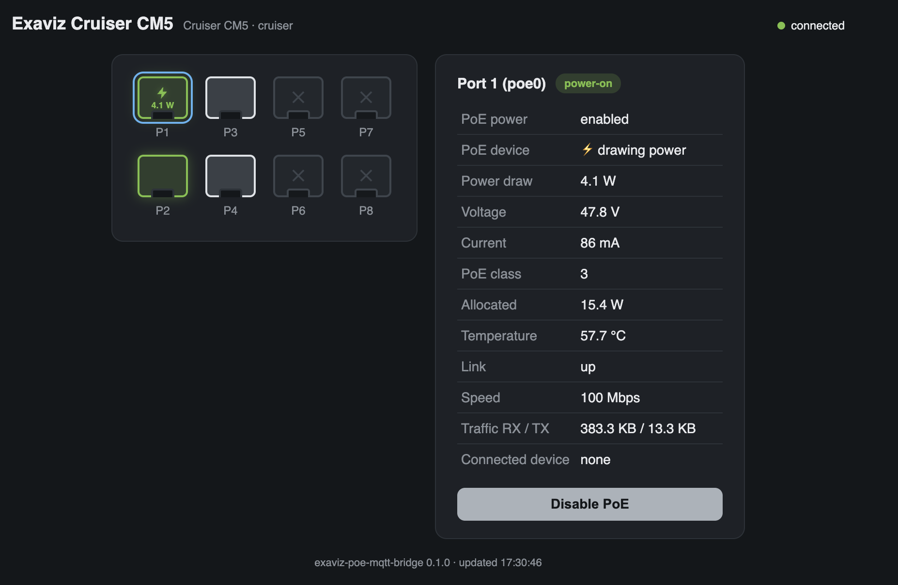

# exaviz-poe-mqtt-bridge

Host-side daemon that exposes **Exaviz Cruiser CM5 PoE ports** to
**Home Assistant OS running inside a KVM/libvirt VM**, using MQTT with
Home Assistant MQTT Discovery.

Because HAOS runs inside a VM, it cannot access host hardware such as
`/dev/pse`. This bridge runs on the Ubuntu host, reads PoE telemetry using
the same logic as Exaviz's official
[ha-poe-plugin](https://github.com/exavizco/ha-poe-plugin), and publishes
native MQTT-discovered entities — no custom component needed inside HAOS.

```
Ubuntu host (RPi CM5 / Cruiser carrier board)
  /dev/pse + exaviz-dkms/exaviz-netplan
        ↓
  exaviz-poe-mqtt-bridge daemon          ← this project
        ↓
  MQTT broker (e.g. Mosquitto add-on)
        ↓
  Home Assistant OS VM
        ↓
  Native MQTT-discovered entities
```

## Entities per PoE port

| Entity | Type | Source |
|---|---|---|
| PoE Power | `switch` (outlet) | ESP32 `enable-port`/`disable-port` + `ip link` |
| Power | `sensor` (W) | V × I from ESP32 telemetry |
| Voltage | `sensor` (V, diagnostic) | ESP32 telemetry |
| Current | `sensor` (mA, diagnostic) | ESP32 telemetry |
| Link | `binary_sensor` (connectivity) | sysfs `operstate` |
| Connected Device | `sensor` + JSON attributes | ARP/NDP table (routed) / bridge FDB + `arp-scan` (switch mode) |

All entities share one HA device (`Exaviz Cruiser CM5`) and a single
availability topic backed by an MQTT Last Will — if the daemon dies, every
entity goes *unavailable* in HA.

## Requirements

- Exaviz Cruiser CM5 carrier board (8-port; Interceptor support planned)
- Ubuntu host with `exaviz-dkms` and `exaviz-netplan` installed from
  [apt.exaviz.com](https://exa-pedia.com/docs/software/apt-repository/)
  (these provide `/dev/pse` and the `poe0`–`poe7` interfaces)
- An MQTT broker reachable from both the host and HAOS
  (typically the Mosquitto add-on inside HAOS)
- Python ≥ 3.10
- `arp-scan` (recommended when running in switch mode — see
  [Network modes](#network-modes)): `sudo apt install arp-scan`

> **Running HAOS in a KVM VM on the Cruiser itself?** See
> [INSTALL.md](INSTALL.md) for the full end-to-end guide (host setup, VM
> networking including the macvtap host↔guest caveat, broker, bridge).

## Installation

```bash
# 1. Install the package (as root, so the systemd unit finds the script)
sudo pip install --break-system-packages .
#    or, to keep the system Python clean:
#    sudo python3 -m venv /opt/exaviz-poe-mqtt-bridge
#    sudo /opt/exaviz-poe-mqtt-bridge/bin/pip install .
#    (then adjust ExecStart in the unit accordingly)

# 2. Create the config
sudo mkdir -p /etc/exaviz-poe-mqtt-bridge
sudo cp config.example.yaml /etc/exaviz-poe-mqtt-bridge/config.yaml
sudo chmod 600 /etc/exaviz-poe-mqtt-bridge/config.yaml   # contains MQTT password
sudo $EDITOR /etc/exaviz-poe-mqtt-bridge/config.yaml     # set broker host/credentials

# 3. Install and enable the service
sudo cp systemd/exaviz-poe-mqtt-bridge.service /etc/systemd/system/
sudo systemctl daemon-reload
sudo systemctl enable --now exaviz-poe-mqtt-bridge

# 4. Check it
systemctl status exaviz-poe-mqtt-bridge
journalctl -u exaviz-poe-mqtt-bridge -f
```

### Verify discovery in Home Assistant

1. In HAOS, make sure the **MQTT integration** is configured against the
   same broker (Settings → Devices & Services → MQTT).
2. After the bridge connects you should see a new device
   **Exaviz Cruiser CM5** under the MQTT integration with 6 entities per
   port, e.g.:
   - `switch.exaviz_cruiser_cm5_port_1_poe_power`
   - `sensor.exaviz_cruiser_cm5_port_1_power`
   - `sensor.exaviz_cruiser_cm5_port_1_voltage`
   - `sensor.exaviz_cruiser_cm5_port_1_current`
   - `binary_sensor.exaviz_cruiser_cm5_port_1_link`
   - `sensor.exaviz_cruiser_cm5_port_1_connected_device`
3. Toggling the switch cuts/restores PoE power on the physical port.

To inspect raw traffic: MQTT integration → *Listen to a topic* →
`exaviz/cruiser/poe/#`.

## Web UI (optional)

A lightweight embedded status page (no build step, single HTML file served
by aiohttp) showing the physical port layout Ubiquiti-style: crossed out
when PoE is disabled, white outline when enabled with no link, green when
a device is connected — with a bolt and live power draw when the device
actually draws PoE. Clicking a port shows every value published to HA
and a button to enable/disable PoE power on that port.



Enable it in the config:

```yaml
web:
  enabled: true
  host: 0.0.0.0
  port: 8088
```

Then browse to `http://<host>:8088`. The JSON API behind it is also
usable directly:

```
GET  /api/status                  # device info + latest port telemetry
POST /api/ports/poe0/power        # body: {"on": true}
```

Devices that don't announce a hostname (no PTR/mDNS) can be given a
friendly name and a [Material Design icon](https://pictogrammers.com/library/mdi/),
keyed by MAC:

```yaml
devices:
  "d0:3b:f4:03:a6:f1":
    name: Entrance camera
    icon: mdi:cctv
```

The icon is shown inside the port, the name under it (and as the HA
connected-device sensor value). Icons use the MDI webfont from a CDN and
degrade gracefully when the browser has no internet access.

⚠️ The web UI has **no authentication** — it exposes the same control
surface as the MQTT command topics. Keep it disabled or bind it to a
trusted interface/network.

## Configuration

Default path: `/etc/exaviz-poe-mqtt-bridge/config.yaml`
(see [config.example.yaml](config.example.yaml) for all options).

```yaml
mqtt:
  host: 10.0.4.180
  port: 1883
  username: homeassistant
  password: changeme
  client_id: exaviz-poe-bridge
  discovery_prefix: homeassistant
  base_topic: exaviz/cruiser/poe

bridge:
  device_name: Exaviz Cruiser CM5
  device_id: cruiser_cm5
  poll_interval: 10
  pse_device: /dev/pse
```

## MQTT topic layout

```
exaviz/cruiser/poe/availability      online/offline (retained, LWT)
exaviz/cruiser/poe/poe0/state        ON/OFF (retained)
exaviz/cruiser/poe/poe0/command      ← HA publishes ON/OFF here
exaviz/cruiser/poe/poe0/power        watts (retained)
exaviz/cruiser/poe/poe0/voltage      volts (retained)
exaviz/cruiser/poe/poe0/current      milliamps (retained)
exaviz/cruiser/poe/poe0/link         ON/OFF (retained)
exaviz/cruiser/poe/poe0/device       hostname/IP summary (retained)
exaviz/cruiser/poe/poe0/attributes   JSON: state, class, temp, traffic… (retained)
```

Discovery configs are published retained under
`homeassistant/{switch,sensor,binary_sensor}/exaviz_cruiser_cm5_poeN_*/config`
and re-published on every reconnect.

## Network modes

The bridge auto-detects how the Cruiser's PoE ports are configured and
adapts the connected-device detection accordingly — no configuration
needed.

**Routed mode** (Exaviz factory default): each `poeN` interface is a
separate L3 port on the host. Devices exchange traffic with the board
itself, so their IP/MAC appear in the port's own ARP/NDP neighbour table
(`ip neigh show dev poeN`). Note that the connected-device sensor only
reports data if the ports actually have per-port subnets/DHCP configured.

**Switch mode** (flat L2): the `poeN` ports and the WAN uplink are
enslaved to a Linux bridge (e.g. `br0`), turning the Cruiser into a plain
switch — devices lease directly from your router. Two things change:

1. Neighbour entries move from the port to the bridge, and — more
   importantly — they usually never appear at all: the board is now an
   L2 bystander that never exchanges traffic with the devices it
   switches. `ip neigh` alone is structurally blind here, no matter how
   often the device renews its lease.
2. The bridge therefore resolves devices in three steps, per port:
   - **bridge FDB** (`bridge fdb show`) → the MAC learned on each port;
   - MAC → IP via the bridge's neighbour table if present, else via an
     **`arp-scan` sweep** of the segment (~1 s, one scan cached 30 s
     serves all ports — install `arp-scan` for this), else via a short
     **passive `tcpdump` capture** of the device's own chatter;
   - reverse DNS for the hostname.

   Without `arp-scan` installed, detection still works but may lag or
   report only the MAC for quiet devices.

PoE telemetry, power control, link state and traffic stats are identical
in both modes. Toggling a port OFF in switch mode detaches it from the
bridge (`ip link down`) in addition to cutting PoE power — non-PoE
devices lose connectivity too, which is usually what you want from a
"disable port" switch.

## How it works

The telemetry/control logic is **derived from Exaviz's official
ha-poe-plugin** (see attribution headers in
[poe.py](exaviz_poe_mqtt_bridge/poe.py) and
[commands.py](exaviz_poe_mqtt_bridge/commands.py)):

- **Telemetry** — reads the ESP32-C6 serial stream on `/dev/pse`
  (115200 baud) for ~3 s per poll and parses lines like
  `0-0: power-on 3 15 48.500 0.325/0.800 35.2`. Actual power is computed
  as V × I (the protocol's "power" field is only the class allocation).
  Link state and traffic come from sysfs; the connected device from the
  ARP/NDP table — and when the port is enslaved to a bridge (Exaviz
  "switch mode", flat L2), from the bridge FDB (learned MAC per port)
  resolved to an IP via the bridge's neighbour table, an `arp-scan`
  sweep of the segment (install `arp-scan` for this; cached 30 s), or a
  short passive capture of the device's own traffic as a last resort.
- **Control** — writes `enable-port <pse> <port>` / `disable-port <pse>
  <port>` to `/dev/pse` and sets the interface admin state with
  `ip link`. Port numbers map as: Linux `poe0-3` → ESP32 PSE 1, `poe4-7`
  → PSE 0. After enabling, the bridge sends a full ESP32 `reset`
  (firmware `detect_class_enable` bug workaround, same as upstream —
  disable via `bridge.enable_reset_workaround: false` once fixed).
- **Safety** — command topics are validated against the port list from
  the board detector; only integer-derived, fixed-format commands are
  ever written to the device (no shell involved). If `/dev/pse` is
  temporarily unavailable the daemon logs and keeps running; the last
  retained values remain in HA and the bridge stays `online`.
- **Port count is dynamic** — detected from the `poe*` interfaces
  created by `exaviz-dkms`, so 8-port Cruiser works today and other
  variants pick up automatically.

## Development

```bash
python3 -m venv .venv && . .venv/bin/activate
pip install -e '.[dev]'

# Simulate 8 PoE ports without any hardware (still talks to MQTT):
exaviz-poe-mqtt-bridge --config config.example.yaml --dry-run --log-level debug

# Run the tests
pytest
```

## Limitations / roadmap

- Interceptor (`/proc/pse`, IP808AR) telemetry is not wired up yet; the
  board is detected and a warning is logged. The reader exists upstream
  and can be ported the same way.
- Manufacturer lookup (OUI) and Bosch-camera protocol detection from the
  upstream plugin are intentionally omitted to keep the daemon lean; the
  connected-device sensor reports IP/MAC/hostname.

## License

Apache-2.0. Portions derived from
[exavizco/ha-poe-plugin](https://github.com/exavizco/ha-poe-plugin).
